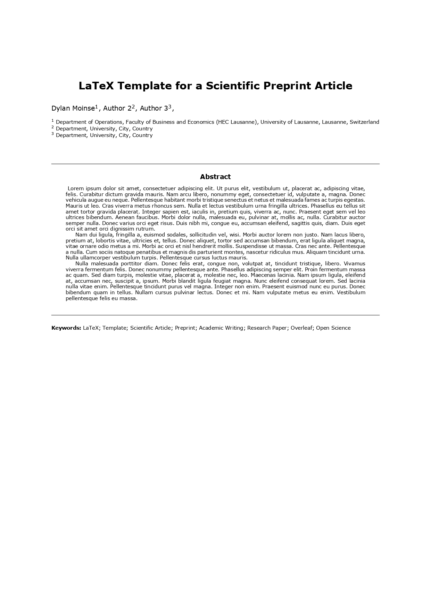
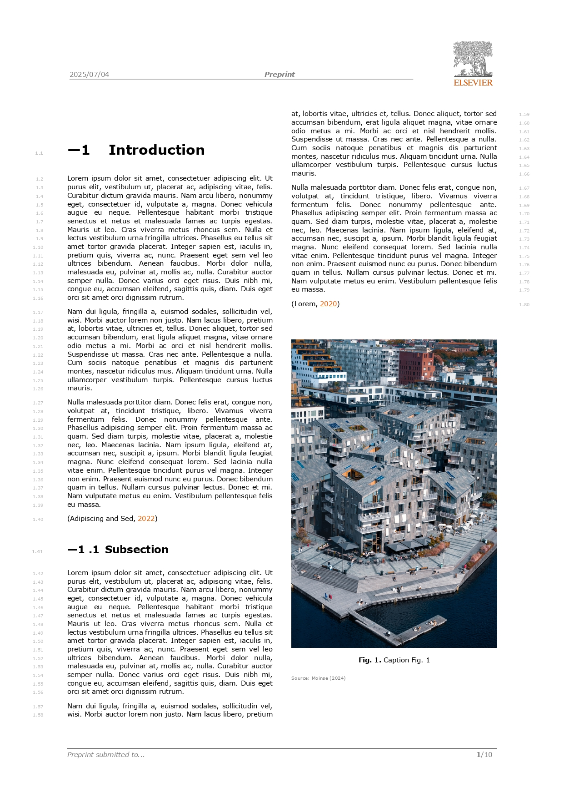
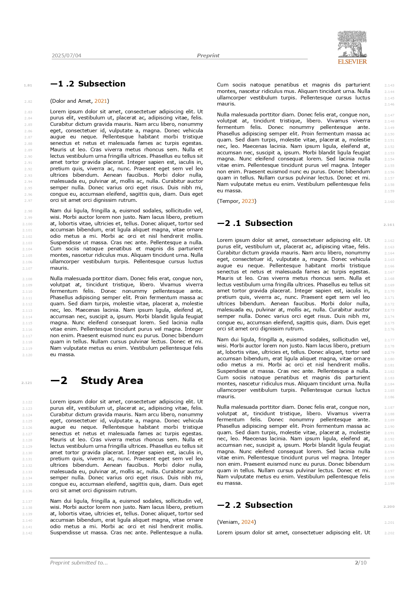
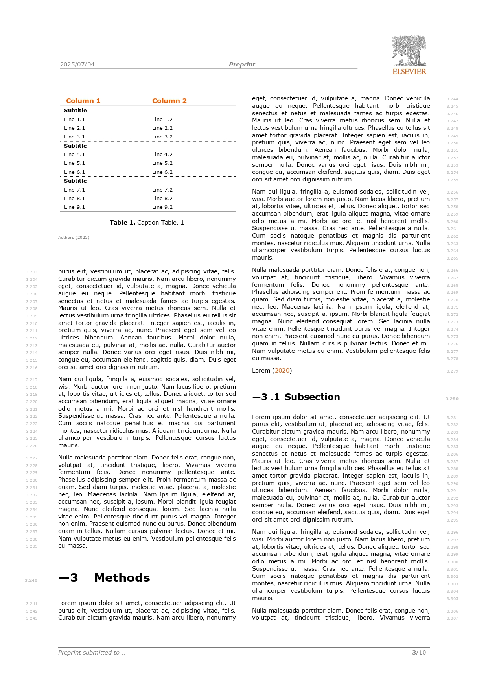
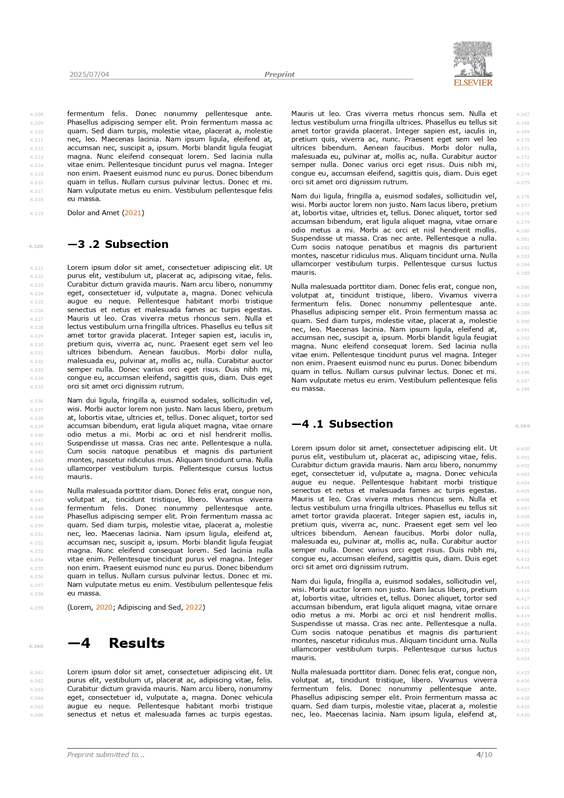
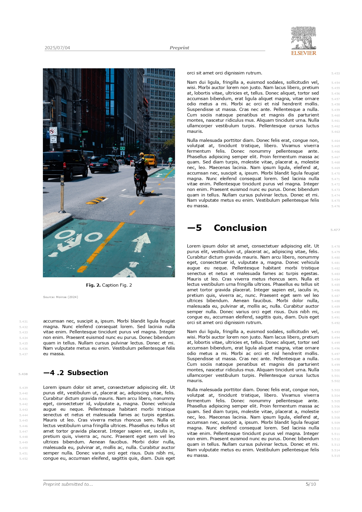
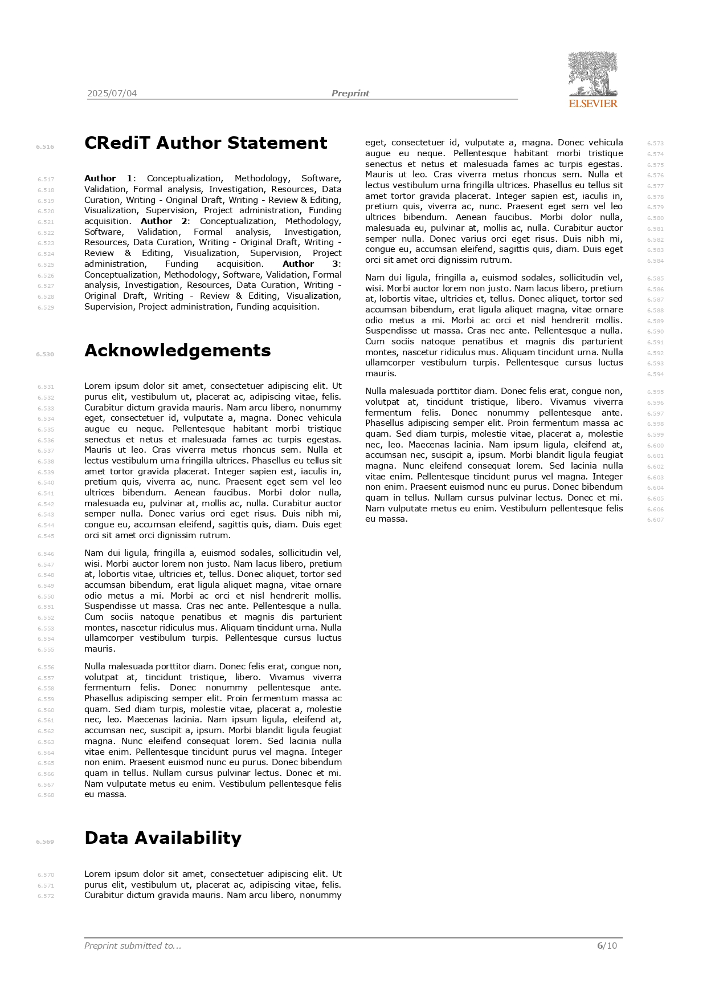
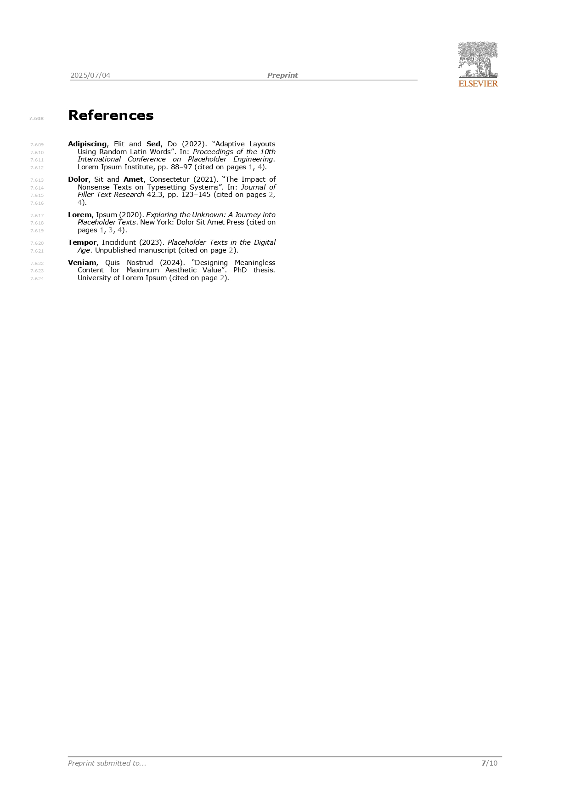
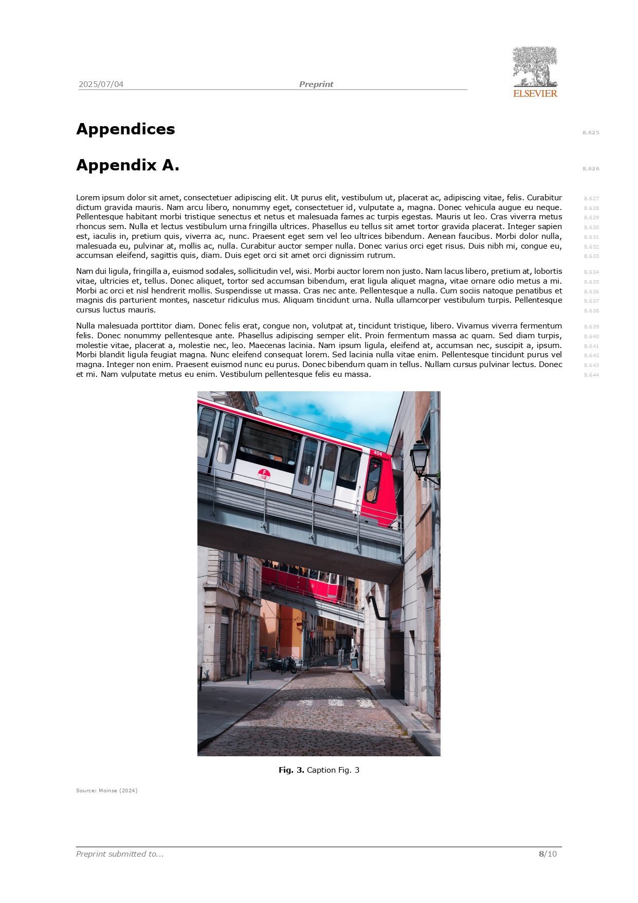
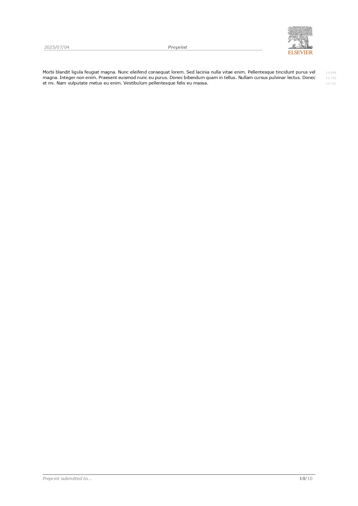

# Preprint *LaTeX* Template

This *GitHub* repository provides a clean and flexible *LaTeX* template for scientific preprints.
It is independent of any publisher’s format, but includes an example styled for a two-column layout similar to *Elsevier* journals.

---

## Features :black_nib:
A fully structured template with:
  - Custom class file: `preprint.cls`.
  - Modular organization by sections (`/sections`).
  - Custom style files (`/style`) for fonts, headers, tables, figures, *etc*.

It supports:
  - Two-column layout (optional).
  - Line numbering (optional).
  - Reference management via BibTeX (`ref.bib`).
  - Table and figure environments.
  - Clean title page (`00-titlepage.tex`) and appendices.

 ---

## Repository Structure :open_file_folder:
The repository is organized as follows:

* `main.tex` - The main *LaTeX* file that compiles the document.
* `preprint.cls` - The main class file that contains packages.

### Style and Formatting Files :art:
* `colors.sty` - Journal colors.
* `fig.sty` - Figure settings.
* `fonts.sty` - Font settings.
* `footers.sty` - Footer title and page number settings.
* `headers.sty` - Header logo.
* `line-numbers.sty` - Line numbers settings.
* `macros.sty` - Commands.
* `margins.sty` - Margins.
* `sections.sty` - Sections settings.
* `table.sty` - Table settings.
* `toc.sty` - Table of contents settings.

### Bibliography :open_book:
* `bib.bib` - The bibliography file containing false references.

### Content :black_nib:
* `sections/...` - Contains all sections (`00-titlepage.tex`, `01-introduction.tex`, *etc*.).
* `fig` - Stores figures.
* `table` - Stores tables.
* `logos` - Stores logos for headers.

## Compilation Instructions :arrows_counterclockwise:
To compile the document, choose one of the following methods:

### Local compilation with `latexmk` and *LuaLaTeX* :computer:

If using a local *LaTeX* editor, run the following command:

```sh
latexmk -pvc -quiet main.tex
```

### Using Compilation with *Overleaf* :signal_strength:

You can also use *Overleaf* to compile the preprint.

## Dependencies :wrench:
Ensure that the following *LaTeX* packages are installed and updated:

| Category| Packages |
|-----------------------|-------------------------------------------------------------|
| **Core Packages** | `ifthen`, `etoolbox`, `xparse` |
| **Page Formatting** | `titlesec`, `titling`, `setspace`, `typearea`, `eso-pic`, `afterpage` |
| **Headers & Footers** | `fancyhdr` |
| **Fonts** | `fontenc`, `fontspec` |
| **References** | `hyperref`, `appendix`, `refcount` |
| **Glossaries** | `glossaries` |
| **Graphics & Tables** | `graphicx`, `subcaption`, `tabularx`, `booktabs`, `multirow`, `longtable`, `caption` |
| **Mathematics** | `amsmath`, `amssymb`, `newpxmath` |
| **Color & Code** | `xcolor[dvipsnames]`, `tcolorbox`, `minted`, `fvextra` |
| **Text & Lists** | `enumitem`, `varwidth`, `contour`, `ulem`, `mfirstuc`, `csquotes` |
| **Date & Time** | `datetime2` |
| **Miscellaneous** | `blindtext`, `lipsum`, `silence`, `textpos`, `tikz`, `lastpage`, `ragged2e`, `needspace`, `emoji` |
| **Multi-column** | `multicol` |
| **To-Do Notes** | `todonotes` |
| **Subfiles** | `subfiles` |

If using *TeX Live* or *MiKTeX*, all required packages can be installed via package managers.

## Screenshots :scissors:

Screenshots showcasing the structure and style of this 11-page document:

<table style="width: 100%;">
  <tbody>
    <tr>
      <td align="center" valign="top" style="width: 33%;">
        
        <br />
        <sub><b></b></sub>
      </td>
      <td align="center" valign="top" style="width: 33%;">
        
        <br />
        <sub><b></b></sub>
      </td>
      <td align="center" valign="top" style="width: 33%;">
        
        <br />
        <sub><b></b></sub>
      </td>
    </tr>
  </tbody>
</table>

<table style="width: 100%;">
  <tbody>
    <tr>
      <td align="center" valign="top" style="width: 33%;">
        
        <br />
        <sub><b></b></sub>
      </td>
      <td align="center" valign="top" style="width: 33%;">
        
        <br />
        <sub><b></b></sub>
      </td>
      <td align="center" valign="top" style="width: 33%;">
        
        <br />
        <sub><b></b></sub>
      </td>
    </tr>
  </tbody>
</table>

<table style="width: 100%;">
  <tbody>
    <tr>
      <td align="center" valign="top" style="width: 33%;">
        
        <br />
        <sub><b></b></sub>
      </td>
      <td align="center" valign="top" style="width: 33%;">
        
        <br />
        <sub><b></b></sub>
      </td>
      <td align="center" valign="top" style="width: 33%;">
        
        <br />
        <sub><b></b></sub>
      </td>
    </tr>
  </tbody>
</table>

<table style="width: 100%;">
  <tbody>
    <tr>
      <td align="center" valign="top" style="width: 33%;">
        
        <br />
        <sub><b></b></sub>
      </td>
      <td align="center" valign="top" style="width: 33%;">
        
        <br />
        <sub><b></b></sub>
      </td>
    </tr>
  </tbody>
</table>

## Contact :speech_balloon:
For any questions or contributions, feel free to contact me via *GitHub Issues* or email.

## Contributors :handshake:
<table style="width: 100%;">
  <tbody>
    <tr>
      <td align="center" valign="top" style="width: 25%;">
        <a href="https://github.com/dylan-moinse">
          
          <br />
          <sub><b>Dylan Moinse</b></sub>
        </a>
        <br />
        <sub>Postdoctoral Researcher</sub>
        <br />
        <a href="https://github.com/all-contributors/app/commits?author=dylan-moinse" title=""></a>
      </td>
  </tbody>
</table>
